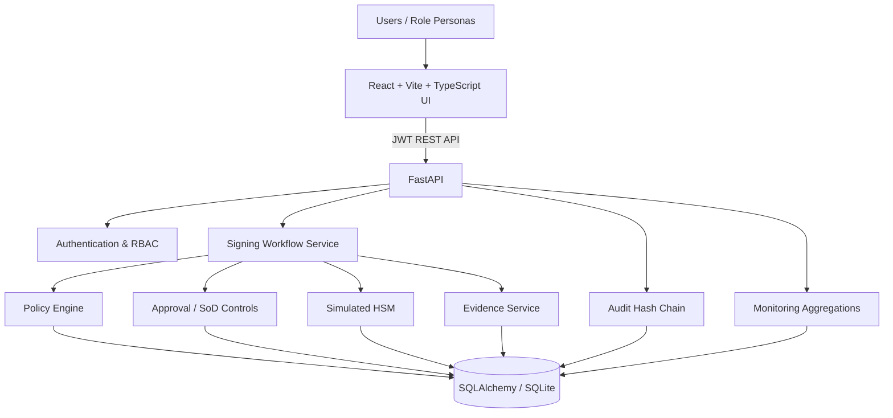

# Secure Key & Code-Signing Control Plane

> Enterprise-style portfolio implementation for governed software signing workflows, policy enforcement, separation of duties, logical key lifecycle management, audit integrity and operational monitoring.

[](#testing)
[](#technology-stack)
[](#technology-stack)
[](#technology-stack)
[](#quick-start)

## Executive summary

This project demonstrates a complete control plane around software code-signing operations. The emphasis is on **governance and security controls**, not production cryptography.

A developer submits a signing request. The backend evaluates policy, verifies the requested logical key, applies environment-specific approval requirements and enforces separation of duties. Once the required approvals are complete, the workflow invokes a **Simulated HSM**, generates an evidence record and appends tamper-evident audit events.

### Core workflow

**Developer → Signing Request → Policy Validation → Security Approval → Release Approval (Production) → Simulated HSM Signing → Evidence + Audit**

> **Security boundary:** The HSM is intentionally simulated. The application does not store, return, display or log private-key material and does not claim to perform production cryptographic signing.

---

## Why this project exists

Real signing platforms need more than a signing API. They need controls around:

- who can request a signature;
- which artifacts are allowed;
- which keys and algorithms may be used;
- which environments require additional approval;
- whether the requester and approver are different people;
- how key lifecycle changes are governed;
- how evidence is produced;
- how audit history can be checked for tampering;
- how operations teams understand current health and failures.

This repository models those controls as a cohesive full-stack application.

---

## Key capabilities

| Capability | Implementation |
|---|---|
| Authentication | JWT-based login and current-user endpoint |
| RBAC | Developer, Security Approver, Release Manager, Key Custodian, Auditor and Admin roles |
| Policy engine | Artifact, key, algorithm, expiry and environment checks |
| Separation of duties | Requester cannot approve their own request |
| Multi-stage approvals | Production: Security + Release |
| Key lifecycle | Activate, Suspend, Rotate, Retire |
| HSM boundary | Simulated HSM with safe metadata only |
| Audit integrity | SHA-256 chained audit entries |
| Evidence | Policy snapshot, approvals, operation metadata and export |
| Monitoring | Dashboard KPIs, HSM health, key usage and approval SLA |
| Deployment | Docker Compose |
| Testing | Backend control tests with pytest |

---

## Architecture



See the detailed [Architecture Guide](docs/ARCHITECTURE.md).

---

## Application modules

### Dashboard
Operational KPIs for pending approvals, signing activity, completed operations, failures, HSM health and active keys, plus key-usage and approval-SLA visualizations.

### Signing Requests
Create, search, filter and track governed signing requests.

### Request Details
Shows workflow progression, policy results, approval decisions and evidence linkage.

### Approvals
Provides role-aware approval queues while keeping authorization authoritative on the backend.

### Keys & Certificates
Displays logical signing-key metadata, certificate metadata, environment, status and usage.

### HSM / Key Vault
Shows Simulated HSM partitions and signing operations.

### Policies
Represents environment-specific rules and required approval stages.

### Audit & Evidence
Provides audit-chain verification and evidence export.

### Monitoring
Operational visibility for health, signing activity and failure trends.

### Users & Roles
Administrative RBAC assignment.

### Settings
Non-secret operational configuration. Secrets remain environment-only.

---

## Security controls

### 1. Policy validation

The policy engine evaluates:

- requester permission;
- allowed artifact type;
- active logical signing key;
- key expiry;
- allowed algorithm;
- key/environment compatibility;
- environment-specific approval requirements.

Seeded permitted algorithms include:

- `RSA-3072/SHA-256`
- `ECDSA-P256/SHA-256`

### 2. Separation of duties

The backend rejects an approval when:

```
requester_id == approver_id
```

This is enforced server-side and therefore does not depend on the React UI.

### 3. Production dual approval

Production requests are configured with:

```
SECURITY → RELEASE
```

Staging and Development use the configured Security approval stage.

### 4. Audit hash chain

Every audit entry contains a previous hash and an entry hash.

```
GENESIS
   ↓
Audit #1
   ↓
Audit #2
   ↓
Audit #3
   ↓
...
```

Changing historical event content causes verification to fail.

This provides **tamper evidence**. It is not represented as an immutable/WORM audit store.

### 5. Simulated HSM boundary

The Simulated HSM receives safe metadata:

- request ID;
- logical key ID;
- algorithm;
- artifact SHA-256;
- partition state.

There is deliberately no private-key field in the data model.

---

## Technology stack

### Backend

- Python 3.11
- FastAPI
- SQLAlchemy
- Pydantic
- JWT
- bcrypt/passlib
- SQLite
- ReportLab
- pytest

### Frontend

- React
- TypeScript
- Vite
- Tailwind CSS
- React Router
- Recharts

### Runtime

- Docker
- Docker Compose
- Nginx for the frontend container

---

## Repository structure

```text
secure-key-control-plane/
├── backend/
│   ├── app/
│   │   ├── api/
│   │   │   └── routes/
│   │   ├── models/
│   │   ├── schemas/
│   │   ├── security/
│   │   └── services/
│   ├── scripts/
│   │   └── seed.py
│   ├── tests/
│   ├── Dockerfile
│   └── requirements.txt
├── frontend/
│   ├── src/
│   │   ├── api/
│   │   ├── components/
│   │   └── pages/
│   ├── Dockerfile
│   └── package.json
├── docs/
│   ├── screenshots/
│   ├── ARCHITECTURE.md
│   ├── API.md
│   ├── DEMO-WALKTHROUGH.md
│   ├── PROJECT_GUIDE.md
│   ├── RUNBOOK.md
│   └── GITHUB-PROFILE-README-TEMPLATE.md
├── ARCHITECTURE.md
├── RUNBOOK.md
├── SECURITY.md
├── CONTRIBUTING.md
├── CODE_OF_CONDUCT.md
├── docker-compose.yml
└── README.md
```

---

## Quick start

### Prerequisites

- Docker Desktop / Docker Engine with Compose v2

### Start

```bash
docker compose up --build
```

### Open

- Frontend: http://localhost:3000
- FastAPI: http://localhost:8000
- Swagger: http://localhost:8000/docs
- Health: http://localhost:8000/health

### Stop

```bash
docker compose down
```

### Reset seeded demo data

```bash
docker compose down -v
docker compose up --build
```

See the [Engineering Runbook](RUNBOOK.md) for operational instructions.

---

## Demo personas

All seeded demo users use the development-only password `Portfolio123!`.

| Persona | Username | Responsibility |
|---|---|---|
| Developer | `developer` | Create signing requests |
| Security Approver | `security` | Security approval |
| Release Manager | `release` | Production release approval |
| Key Custodian | `custodian` | Key lifecycle controls |
| Auditor | `auditor` | Audit/evidence visibility |
| Administrator | `admin` | RBAC and configuration |

These are intentionally public portfolio credentials. **Never reuse them outside the local demo.**

---

## Testing

Backend tests:

```bash
cd backend
pytest -q
```

Current automated controls cover:

- policy-engine behavior;
- requester/approver separation of duties;
- audit hash-chain verification and tamper detection.

Frontend production build:

```bash
cd frontend
npm install
npm run build
```

---

## Documentation

- [Project Architecture](docs/ARCHITECTURE.md)
- [API Overview](docs/API.md)
- [Demo Walkthrough](docs/DEMO-WALKTHROUGH.md)
- [Engineering Runbook](docs/RUNBOOK.md)
- [Security Policy](SECURITY.md)
- [Contributing Guide](CONTRIBUTING.md)
- [Code of Conduct](CODE_OF_CONDUCT.md)
- [Project Guide](docs/PROJECT_GUIDE.md)
- [GitHub Profile README Template](docs/GITHUB-PROFILE-README-TEMPLATE.md)

---

## Production-readiness boundary

This is a portfolio implementation and should not be represented as a production signing platform.

Known boundaries:

1. HSM integration is simulated.
2. No private-key material is stored.
3. SQLite is used for local demonstration.
4. Audit chaining provides tamper evidence, not immutable storage.
5. Demo credentials are intentionally public.
6. The generated signature is a simulation and is not production cryptographic proof.

---

## Repository security

For a public repository, enable GitHub security controls such as Dependabot alerts, secret scanning, push protection and code scanning where available. GitHub also recommends documenting vulnerability reporting and repository contribution expectations.

See [SECURITY.md](SECURITY.md) and [CONTRIBUTING.md](CONTRIBUTING.md).

---

## Portfolio positioning

**Secure Key & Code-Signing Control Plane**  
Designed and built a full-stack control plane for governed software-signing workflows, implementing policy validation, RBAC, separation of duties, multi-stage approvals, logical key lifecycle controls, a Simulated HSM, tamper-evident audit chaining, evidence generation and operational monitoring using FastAPI, React, TypeScript, SQLAlchemy and Docker.
