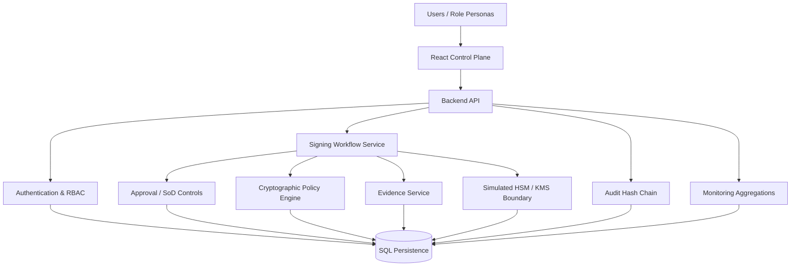
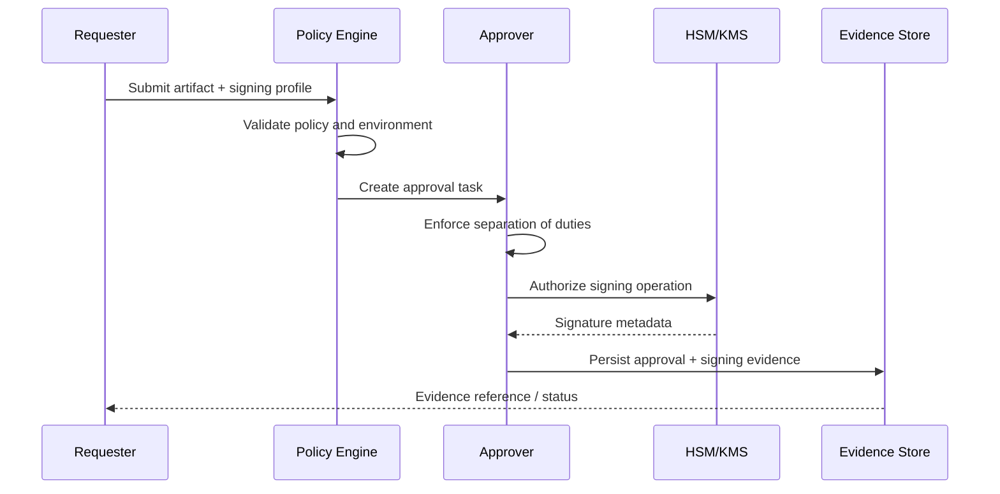

# Secure Key & Code-Signing Control Plane — Workflow Architecture

## System flow

## Secure signing workflow

## Security boundary

Private keys are modelled as non-exportable assets behind the HSM/KMS boundary. Production authorization, cryptographic policy and separation-of-duties controls must be enforced server-side; the browser is not a trusted security boundary.
